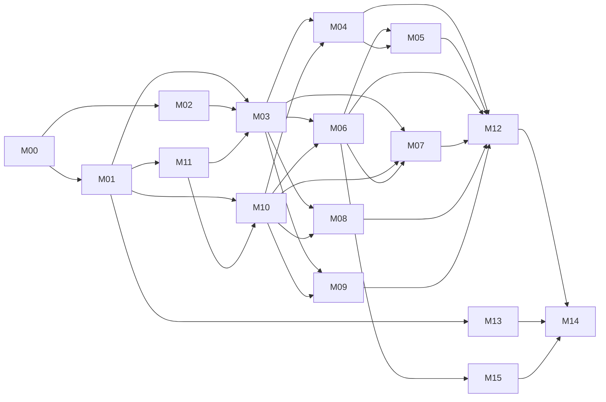

# Tamanly Platform (Rails) Implementation Plan

> **For agentic workers:** REQUIRED SUB-SKILL: Use superpowers:subagent-driven-development (recommended) or superpowers:executing-plans to implement this plan task-by-task. Steps use checkbox (`- [ ]`) syntax for tracking. Each file in `modules/` is a self-contained work package: one agent owns one module at a time. Before coding a module, expand its tasks into code-level, test-first steps with superpowers:writing-plans, using the module guide as the spec.

**Goal:** Build the Tamanly backend as one Rails app, matching the prototypes in this repo:
- the management web dashboard (`/admin`);
- the guard console (`/security`);
- a versioned JSON API for the resident and guard mobile app (`/api/v1`);
- push notifications;
- the platform console (`/platform`), where Tamanly, as the service provider, runs its subscribing customers.

**Architecture:** One Rails monolith on PostgreSQL. Hotwire (Turbo + Stimulus) and Tailwind render the dashboard and guard console. The mobile app talks to `/api/v1` with bearer tokens. Background work runs on Solid Queue. Push goes through Firebase Cloud Messaging HTTP v1, which reaches both Android and iOS. Live boards use Turbo Streams over Solid Cable. Every record hangs off a taman, and every query goes through `Current` and Pundit scopes, so a management company only ever sees its own tamans. Residents pay straight into each customer's own Billplz account, and Tamanly bills customers separately for its service (ADR-011a, ADR-025).

**Tech Stack:** Ruby 3.4+, Rails 8.1+, PostgreSQL 16+, Hotwire, Tailwind CSS v4 (`tailwindcss-rails`), ViewComponent, Pundit, Pagy, Solid Queue / Cache / Cable, Active Storage (S3-compatible), RSpec + FactoryBot + rswag (OpenAPI) + Capybara/Cuprite, Firebase (FCM HTTP v1 push and phone sign-in, via `googleauth`), Billplz (payments), `rqrcode`, Prawn, Rack::Attack, Kamal. No SMS provider (ADR-012).

**Spec (read before any module):**
- `../../../../FEATRURES.md`: the feature list. "Mobile app" bullets become API work; "Web dashboard" bullets become admin work.
- `../../../../PRODUCT.md`: users, roles, product principles.
- `../../../../DESIGN.md`: the visual system for the dashboard and guard console.
- UI references, which are clickable prototypes:
  - `../../../../admin/` is the dashboard.
  - `../../../../security/` is the guard console.
  - `../../../../storyboard/` holds the mobile screens.
  - The live copy is at https://vincentlkl.github.io/tamanly/ (password-gated; ask the owner for the password).
- Data shapes and realistic volumes: `../../../../admin/data.js` (synthetic, seeded).

## Global Constraints

Every task's requirements implicitly include this section.

- Money is MYR, stored as integer sen in `*_cents` columns, displayed `RM 1,050.00` (two decimals, thousands separator). Never use floats.
- Business dates and "today" use `Asia/Kuala_Lumpur`. Store timestamps as UTC. API times are ISO 8601 with the `+08:00` offset.
- Languages are English and Bahasa Melayu (`en`, `ms`). Every user-facing string, email and push template exists in both.
- A management company sees and edits only its own tamans. A resident sees only units they actively occupy. A sub-tenant gets only the scopes granted: `bills_view`, `bills_pay`, `visitor_passes`, `facility_booking`.
- Staff roles: `portfolio_admin`, `taman_manager`, `billing_ops`, `security_lead`. Field role: `guard`. Occupant relationships: `owner`, `tenant`, `sub_tenant`.
- Permit statuses, exactly: Pending Review, Docs requested, Pending Deposit, Approved, Work In Progress, Inspection Scheduled, Completed, Deposit Refunded, Rejected.
- Primary keys are UUIDs (`gen_random_uuid()`).
- Phone numbers are stored in E.164 (`+60123456789`).
- Every admin write records an `AuditEvent`.
- The dashboard and guard console work from 390px up. Index tables fall back to cards when they don't fit their panel. Touch targets are at least 48px. Tokens, type and components follow `DESIGN.md`.
- API: `/api/v1`, JSON, snake_case, `Authorization: Bearer <token>`, cursor pagination, a single error envelope (see `contracts.md`).
- Copy is sentence case, plain words, and names the next action. Error messages name the problem and the fix.
- Prefer Rails defaults and the listed gems. Adding a gem needs a line in `decisions.md`.

## Review Focus

Each line below is backed by a test in the owning task.

1. **Cross-tenant access by guessed IDs.** Staff of company A requesting a unit, invoice or permit of company B, or a resident requesting a unit they don't occupy, gets `404`, never data. Covered by the shared example `"a tenant-isolated endpoint"` in M01 T01.5, which every resource spec must include.
2. **Double charges.** A payment-gateway webhook delivered twice, or a "Pay" tap sent twice, creates exactly one successful payment and one allocation. Covered in M06 T06.4 (webhook dedupe) and M11 T11.4 (`Idempotency-Key`).
3. **Double-booked facility slots.** Two residents booking the same slot at the same moment produce one booking; the second gets `409 slot_taken`. Covered in M07 T07.2 (a Postgres exclusion constraint plus a concurrency spec).
4. **Notifications to the wrong people.** An ended tenancy or a sub-tenant without `bills_view` receives no bill or visitor pushes. Recipients are resolved at send time from active occupancies. Covered in M10 T10.5.
5. **Midnight and time-zone edges.** A pass created at 23:30 KL time with 4-hour validity is valid until 03:30 the next day. "Arriving today" for guards uses the KL date. An invoice due "15 Oct" is overdue from 16 Oct 00:00 KL. A night shift that starts Saturday 19:00 is still on duty at Sunday 02:00. Covered in M04 T04.2 (passes) and T04.7 (guard arrivals), M04 T04.9 (night shift), M06 T06.1 (overdue boundary) and T06.7 (reminders and late fees).

---

## How this plan is organised

| File | What it holds |
|---|---|
| `README.md` | This overview, the module map, progress and the agent protocol |
| `decisions.md` | Architecture decisions (ADRs) with reasons and alternatives |
| `contracts.md` | Shared names every module relies on: `Current`, permissions, `Notifier`, payments, gate verdicts, API envelope, event catalog |
| `modules/mNN-*.md` | One work package per module: scope, data model, interfaces, endpoints, tasks with checklists, progress log |
| `progress.rb` | Counts checkboxes and rewrites the progress table below |

## Module map

| ID | Module | Wave | Depends on | Owns (admin · API · jobs) |
|---|---|---|---|---|
| M00 | [Foundation](modules/m00-foundation.md) | 0 | none | App, config, CI, shared helpers, seeds frame |
| M01 | [Identity, tenancy & permissions](modules/m01-identity-tenancy.md) | 1 | M00 | Orgs, users, staff sign-in, Firebase phone sign-in + API tokens (services), permissions, audit, users & roles admin |
| M02 | [Admin shell & UI kit](modules/m02-admin-shell.md) | 1 | M00 (M01 for real data) | Layout, sidebar, scope switcher, index engine, drawer, palette, worklist frame |
| M11 | [API platform](modules/m11-api-platform.md) | 1 | M00, M01 T01.4 | Base controller, auth endpoints, errors, pagination, idempotency, rate limits, OpenAPI |
| M03 | [Properties & occupancy](modules/m03-properties.md) | 2 | M01, M02, M11 | Tamans, blocks, units, occupants, property switcher API |
| M10 | [Notifications & push](modules/m10-notifications-push.md) | 2 | M01, M11 | Devices, inbox, preferences, FCM, `Notifier`, staff bell |
| M04 | [Gate & security operations](modules/m04-gate-security.md) | 3 | M03, M10 | Passes, gate checks, walk-ins, guard API, guard console, registry, roster, incidents, parcels |
| M06 | [Billing & payments](modules/m06-billing-payments.md) | 3 | M03, M10 | Invoices, schedules, bulk import, payout accounts and routes, Billplz, receipts, reconciliation, escrow, late fees, statements |
| M07 | [Facilities](modules/m07-facilities.md) | 3 | M03, M10, M06 (fees) | Catalog, rules, bookings, calendar, utilization |
| M08 | [Marketplace](modules/m08-marketplace.md) | 3 | M03, M10 | Listings, categories, moderation, reports |
| M09 | [Communications](modules/m09-communications.md) | 3 | M03, M10 | Announcements, templates, broadcasts, home feed |
| M05 | [Permits & contractors](modules/m05-permits.md) | 4 | M04, M06 | Permit types, applications, review, deposits, passes, on-site board, inspections, refunds, enforcement |
| M12 | [Analytics & overview](modules/m12-analytics.md) | 4 | M03–M09 | Overview dashboard, daily stats, analytics page |
| M13 | [Settings & integrations](modules/m13-settings-integrations.md) | 4 | M01, M03 | Taman profile & branding, payout accounts page and cut-over, email, gate webhooks, audit log UI, help & support |
| M15 | [Platform console & subscriptions](modules/m15-platform-console.md) | 4 | M01, M02, M06, M10 | Operator access, customer onboarding, plans, monthly invoices to customers, overdue handling and suspension, platform dashboard |
| M14 | [Launch readiness](modules/m14-launch.md) | 5 | all | Security hardening, performance, observability, backups, mobile release plumbing |



**Parallel work:** inside a wave, modules don't touch each other's tables. Wave 3 can run five agents at once. A module may start before its dependencies finish if it codes against the interface in `contracts.md` and swaps a stub for the real class when the dependency lands. Mark any stub in the module's progress log.

## Progress

Run `ruby docs/superpowers/plans/2026-10-04-tamanly-platform/progress.rb` after ticking boxes; it rewrites this table.

<!-- progress:start -->
| Module | Status | Owner | Tasks done | Steps done |
|---|---|---|---|---|
| [M00 · Foundation](modules/m00-foundation.md) | Not started | — | 0/5 | 0/39 |
| [M01 · Identity, tenancy & permissions](modules/m01-identity-tenancy.md) | Not started | — | 0/9 | 0/65 |
| [M02 · Admin shell & UI kit](modules/m02-admin-shell.md) | Not started | — | 0/7 | 0/47 |
| [M03 · Properties & occupancy](modules/m03-properties.md) | Not started | — | 0/6 | 0/38 |
| [M04 · Gate & security operations](modules/m04-gate-security.md) | Not started | — | 0/10 | 0/56 |
| [M05 · Permits & contractors](modules/m05-permits.md) | Not started | — | 0/8 | 0/44 |
| [M06 · Billing & payments](modules/m06-billing-payments.md) | Not started | — | 0/9 | 0/57 |
| [M07 · Facilities](modules/m07-facilities.md) | Not started | — | 0/5 | 0/27 |
| [M08 · Marketplace](modules/m08-marketplace.md) | Not started | — | 0/3 | 0/15 |
| [M09 · Communications](modules/m09-communications.md) | Not started | — | 0/3 | 0/15 |
| [M10 · Notifications & push](modules/m10-notifications-push.md) | Not started | — | 0/6 | 0/36 |
| [M11 · API platform](modules/m11-api-platform.md) | Not started | — | 0/5 | 0/33 |
| [M12 · Analytics & overview](modules/m12-analytics.md) | Not started | — | 0/3 | 0/15 |
| [M13 · Settings & integrations](modules/m13-settings-integrations.md) | Not started | — | 0/5 | 0/26 |
| [M14 · Launch readiness](modules/m14-launch.md) | Not started | — | 0/5 | 0/41 |
| [M15 · Platform console & subscriptions](modules/m15-platform-console.md) | Not started | — | 0/6 | 0/31 |
| **Total** | | | **0/95** | **0/585** |
<!-- progress:end -->

## Agent protocol

1. **Claim.** Set `**Status:** In progress` and `**Owner:** <agent or person>` in the module header. Add a dated line to its progress log.
2. **Branch.** `mNN/<short-task>` (e.g. `m06/bulk-invoices`). One task per pull request where possible.
3. **Read first.** Read this README's Global Constraints and Review Focus, `contracts.md`, the module guide, and the prototype screens it links.
4. **Plan the code.** Expand the task into test-first steps with superpowers:writing-plans. The module guide fixes names, tables, routes and test cases. Don't rename them; other modules depend on them.
5. **Test first.** Write the named specs, watch them fail, implement, watch them pass. Every resource endpoint includes `it_behaves_like "a tenant-isolated endpoint"`.
6. **Tick as you go.** Check each step box when done, then run `progress.rb`. Record blockers and stubs in the progress log.
7. **Changing a contract.** If an interface in `contracts.md` must change, update `contracts.md` and the owning module guide in the same pull request, and note it in the progress log of every module that consumes it.
8. **Finish.** Meet the module's Definition of done, set Status to `In review`, and open the pull request. Set `Done` after merge.

Status values: `Not started`, `In progress`, `Blocked`, `In review`, `Done`.

## Definition of done (every task)

- [ ] Named specs in the task exist and pass. The full suite (`bin/rspec`) is green.
- [ ] `bin/rubocop` and `bin/brakeman --no-pager` are clean.
- [ ] New strings exist in `config/locales/en` and `config/locales/ms`.
- [ ] Admin writes record an `AuditEvent`. New endpoints have rswag specs and appear in `swagger/v1/openapi.yaml`.
- [ ] Admin pages checked at 390px and 1440px (system spec or screenshot in the pull request).
- [ ] Seeds extended if the task adds a model a screen needs.
- [ ] Module progress log updated and `progress.rb` run.

## Repository layout (the Rails app)

The Rails app lives next to this plan repo: `/Users/vincent/work/ror/apps/vincent/tamanly/app` (decision ADR-001).

```
app/
  models/                      # one file per table; concerns in models/concerns
  controllers/admin/           # web dashboard (namespace Admin)
  controllers/security/        # guard console (namespace Security)
  controllers/platform/        # Tamanly's own platform console (namespace Platform)
  controllers/api/v1/          # mobile API (namespace Api::V1)
  controllers/webhooks/        # Billplz payment callbacks
  services/<domain>/           # e.g. gate/check_pass.rb, payments/checkout.rb
  policies/                    # Pundit policies
  components/ui/               # ViewComponents for the design system
  notifications/               # Notifications::Catalog and templates
  jobs/<domain>/
  javascript/controllers/      # Stimulus
config/locales/{en,ms}/<domain>.yml
spec/{models,requests,system,services,jobs,support}
swagger/v1/openapi.yaml
```
